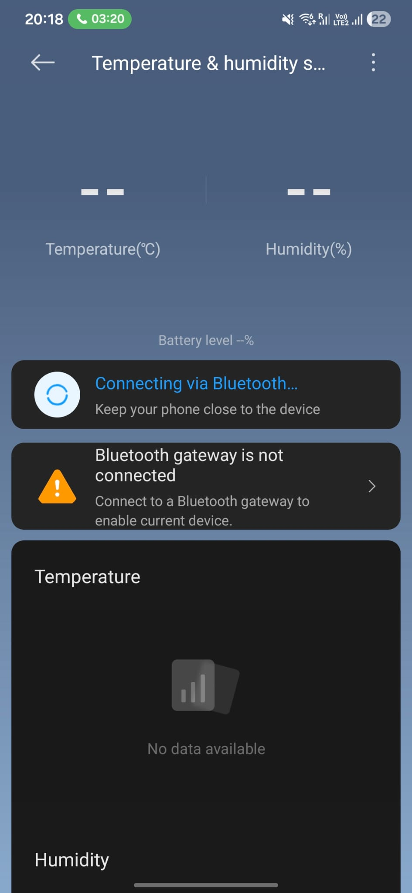
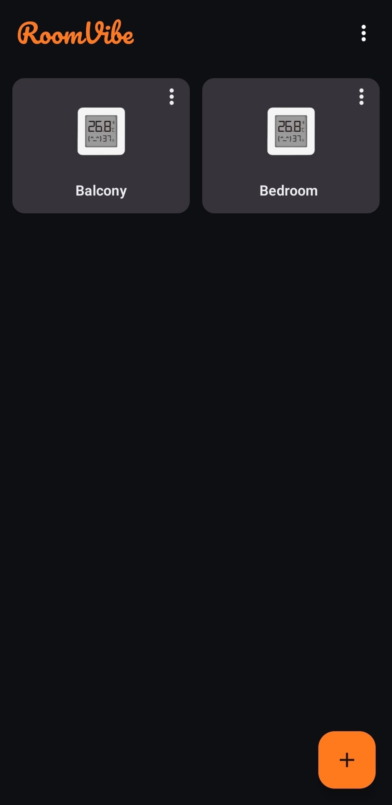
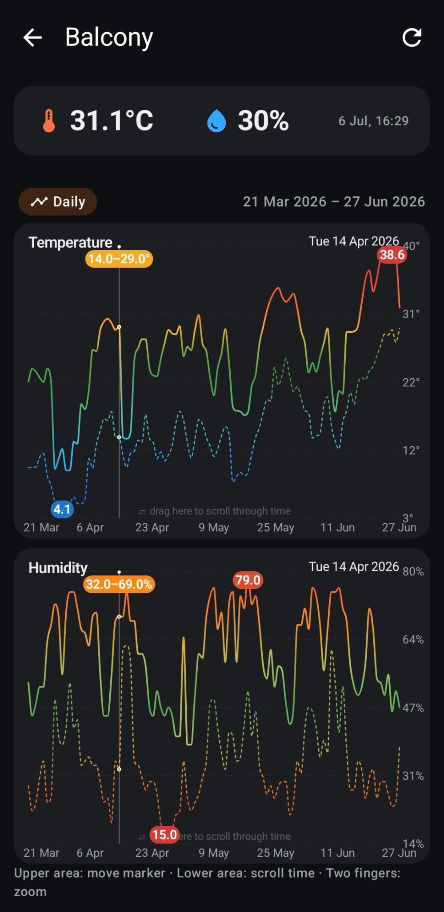
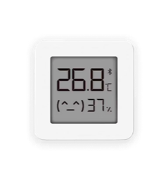

# RoomVibe

Read and store the **full temperature & humidity history** from Xiaomi
**LYWSD03MMC** (Mijia "Temperature and Humidity Monitor 2") sensors over Bluetooth,
and browse it offline with zoomable, colour-coded charts.

The official Xiaomi app only lets you view a limited window and requires you to be
near the sensor. RoomVibe downloads the sensor's on-device history (a few months),
saves it locally on your phone, and lets you explore **any** hour, day, or month —
even when you're away from home.

<p align="center">
  
  <br>
  <em>The official app shows nothing when it isn't connected to the sensor over Bluetooth.</em>
</p>

> Not affiliated with or endorsed by Xiaomi. "Xiaomi" and "Mijia" are trademarks of
> their respective owners.

## Screenshots

<p align="center">
  
  &nbsp;&nbsp;
  
</p>

## Download

📦 **[Download the latest APK »](https://github.com/ValeriuProdan/RoomVibe/releases/latest)**

1. Download `RoomVibe-<version>.apk` from the latest release.
2. On your Android phone (8.0+), open the file and allow *"install from unknown
   sources"* if prompted.
3. Open RoomVibe, tap the **+** button, and scan for your sensor.

> Tip: force-stop the official Xiaomi / Mi Home app first, so it releases the
> sensor's Bluetooth connection.

## Features

- **Full history download** — pulls every stored hourly record from the sensor and
  keeps it in a local database, so you can read it offline and from anywhere.
- **Zoomable timeline charts** — pinch to zoom smoothly from hourly detail out to
  days and months; drag to scroll through time; tap/drag to inspect exact values.
- **Comfort-coloured lines** — temperature is coloured by human thermal comfort
  (green ≈ 20–25 °C, blue when cold, red when hot); humidity is green at the ideal
  (~48%) and red at the dry/humid extremes.
- **°C / °F** toggle.
- **Google Drive backup & restore** — export/import all data as a JSON file via the
  system picker (no account setup required).
- Manage multiple sensors, rename them, and refresh on demand.

## Compatibility

<p align="center">
  <a href="https://www.mi.com/uk/item/3204500023">
    
  </a>
</p>

- Android **8.0+** (API 26) with Bluetooth LE.
- Xiaomi **LYWSD03MMC** — the
  [Mi Temperature and Humidity Monitor 2](https://www.mi.com/uk/item/3204500023)
  — and other Mijia thermometers that expose the classic `ebe0ccb0` history
  service. Devices flashed with the open-source
  [pvvx firmware](https://pvvx.github.io/ATC_MiThermometer/) (`ATC_*`) also work.

See **[SETUP.md](SETUP.md)** for detailed setup, pairing, and firmware notes.

## Building from source

Requires JDK 17–21 (Android Studio's bundled JBR works well).

```bash
# Debug build (auto-signed, installable for testing)
./gradlew :app:assembleDebug

# Signed release build — needs a keystore.properties in the project root:
#   storeFile=your-release.jks
#   storePassword=...
#   keyAlias=...
#   keyPassword=...
./gradlew :app:assembleRelease
```

If your system default Java is newer than 21, point Gradle at a compatible JDK:

```bash
JAVA_HOME="/Applications/Android Studio.app/Contents/jbr/Contents/Home" ./gradlew :app:assembleRelease
```

## Credits

- Wordmark uses the [Pacifico](https://github.com/googlefonts/Pacifico) font,
  licensed under the SIL Open Font License 1.1 (see `licenses/Pacifico-OFL.txt`).
- BLE history protocol based on the community reverse-engineering of the Mijia
  LYWSD03MMC / LYWSD02 sensors.
